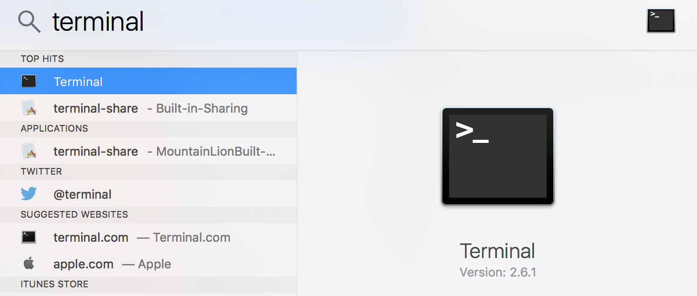
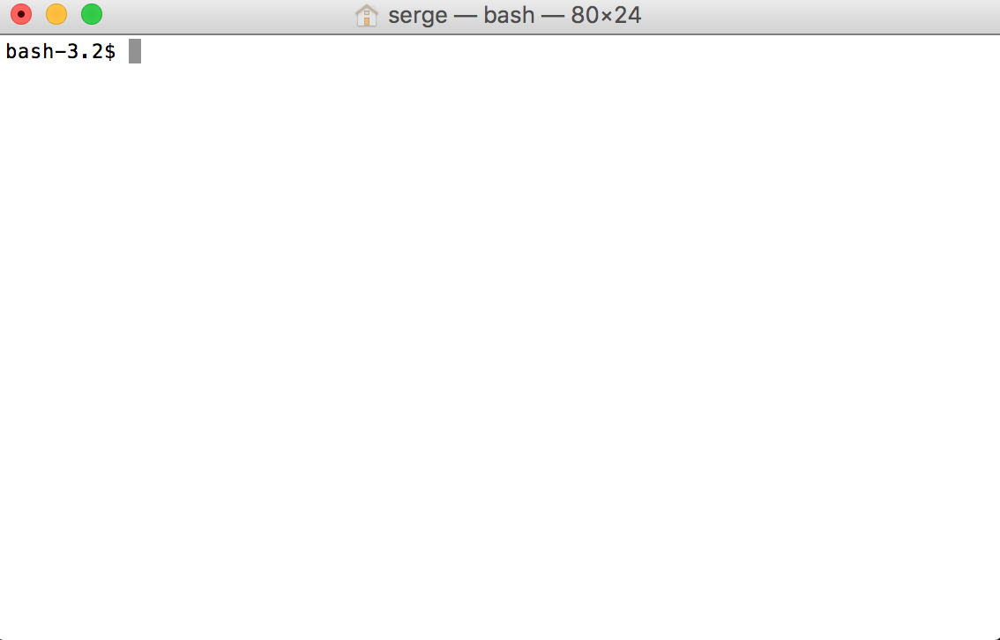

# Shell

## Why use a  shell?

- efficiency
- flexibility
- power

## How to start

There are several ways to start a terminal, depending on your operating
system. On a Mac, you can call up spotlight with `Command-space` and then type
`term` in which case terminal should show up as an option to select:



Hitting `Enter` will start a terminal which should look something like:




## Where am I and how do I move around?
```
bash-3.2$ cd
bash-3.2$ pwd
/Users/serge
```

Ok, how to I get to a particular directory?
```
bash-3.2$ cd /Users/serge/Dropbox/g/GIS321/F16/book/content/data/airports
bash-3.2$ pwd
/Users/serge/Dropbox/g/GIS321/F16/book/content/data/airports
```


## Where am I and what do we have?

```
bash-3.2$ pwd
/Users/serge/Dropbox/g/GIS321/F16/book/content/data/airports
```

What do we have in this directory?
```
bash-3.2$ ls
README.md    data.csv    landUse.dat
```

More details please?
```
sh-3.2$ ls -al
total 1048
drwxr-xr-x@ 6 serge  staff     204 Aug 29 08:07 .
drwxr-xr-x@ 5 serge  staff     170 Aug 24 17:56 ..
-rw-r--r--@ 1 serge  staff     103 Aug 23 17:30 README.md
-rw-r--r--@ 1 serge  staff  524163 Aug 23 17:30 data.csv
-rw-r--r--@ 1 serge  staff      85 Aug 29 08:07 landUse.dat
bash-3.2$
```

## Looking into a file with `cat`

We have a small data set in the file `landUse.dat`. To see it contents
we can use the `cat` command

```
bash-3.2$ cat landUse.dat
industrial 25
residential 5
industrial 14
commercial 40
residential 10
industrial 25
```

This is a space-delimeted file with two attributes, a land use type which
is a categorical variable and a numeric value representing number of units on
the parcel.


## Manipulating files: sort

```
bash-3.2$ sort landUse.dat
commercial 40
industrial 14
industrial 25
industrial 25
residential 10
residential 5
bash-3.2$
```

## Manipulating files: uniq

```
bash-3.2$ uniq landUse.dat
industrial 25
residential 5
industrial 14
commercial 40
residential 10
industrial 25
```

Not quite right as `industrial 25` appears twice. 
Why?
```
man uniq

UNIQ(1)                   BSD General Commands Manual                  UNIQ(1)

NAME
     uniq -- report or filter out repeated lines in a file

SYNOPSIS
     uniq [-c | -d | -u] [-i] [-f num] [-s chars] [input_file [output_file]]

DESCRIPTION
     The uniq utility reads the specified input_file comparing adjacent lines,
and writes a copy of each unique input line to the output_file.  If input_file
is a single dash (`-') or
     absent, the standard input is read.  If output_file is absent, standard
output is used for output.  The second and succeeding copies of identical
adjacent input lines are not
     written.  Repeated lines in the input will not be detected if they are
not adjacent, so it may be necessary to sort the files first.
```

Ah, so let's get the duplicating records to be adjacent using `sort`


```
bash-3.2$ sort landUse.dat
commercial 40
industrial 14
industrial 25
industrial 25
residential 10
residential 5
```

Now if we can get that passed to `uniq` we should be in business. We can do
this with a `pipe`

```
bash-3.2$ sort landUse.dat | uniq
commercial 40
industrial 14
industrial 25
residential 10
residential 5
bash-3.2$
```


## Sorting by a specified column

Let's sort not by land use type, but rather by number of units
```
bash-3.2$ sort -n -k2,2 landUse.dat
residential 5
residential 10
industrial 14
industrial 25
industrial 25
commercial 40
bash-3.2$
```

What if we wanted this in descending order?

```
bash-3.2$ sort -n -r -k2,2 landUse.dat
commercial 40
industrial 25
industrial 25
industrial 14
residential 10
residential 5
bash-3.2$
```

Note we have to do a numeric sort as reflected in the `-n` argument above. If
we omit that we get an alphanumeric sort of the second column:

```
bash-3.2$ sort -k2,2 landUse.dat
residential 10
industrial 14
industrial 25
industrial 25
commercial 40
residential 5
bash-3.2$
```


## Appending 


Let's say we wanted to add a header to the data but we also wanted to preserve
the original file. We can do this with a redirection of standard output to a
file:

```
bash-3.2$ echo 'landUse units' > data_hdr.csv
bash-3.2$ cat data_hdr.csv
landUse units
```

Next we append the original file to this new file, again redirecting the
output:

```
bash-3.2$ cat landUse.dat >> data_hdr.csv
bash-3.2$ cat data_hdr.csv
landUse units
industrial 25
residential 5
industrial 14
commercial 40
residential 10
industrial 25
bash-3.2$
```

and the original file remains untouched:

```
bash-3.2$ cat landUse.dat
industrial 25
residential 5
industrial 14
commercial 40
residential 10
industrial 25
bash-3.2$
```

## Chaining


Sometimes it is more efficient to chain commands together in a single line.  Here we will combine three commands, first deleting the file we created with the header, and then rebuilding it: 

```
bash-3.2$ rm data_hdr.csv ; echo 'landUse units' > data_hdr.csv ; cat landUse.dat >> data_hdr.csv
bash-3.2$ cat data_hdr.csv
landUse units
industrial 25
residential 5
industrial 14
commercial 40
residential 10
industrial 25
bash-3.2$
```

## Redirecting

```
bash-3.2$ sort < landUse.dat
commercial 40
industrial 14
industrial 25
industrial 25
residential 10
residential 5
bash-3.2$ sort < landUse.dat > landUse_srt.dat
bash-3.2$ cat landUse_srt.dat
commercial 40
industrial 14
industrial 25
industrial 25
residential 10
residential 5
```


## Peeking into the file

Let's move on to a more interesting file, one recording airport locations
on planet earth.

We obtained this file from:
 https://commondatastorage.googleapis.com/ckannet-storage/2012-07-09T214020/global_airports.csv

and renamed it to `data.csv`
```
bash-3.2$ mv global_airports.csv data.csv
```

We can get a listing of the first 5 lines of the file with `head`

```
bash-3.2$  head -5 data.csv
airport_id,name,city,country,iata_faa,iaco,latitude,longitude,altitude,zone,dst
1,Goroka,Goroka,Papua New Guinea,GKA,AYGA,-6.081689,145.391881,5282,10,U
2,Madang,Madang,Papua New Guinea,MAG,AYMD,-5.207083,145.7887,20,10,U
3,Mount Hagen,Mount Hagen,Papua New Guinea,HGU,AYMH,-5.826789,144.295861,5388,10,U
4,Nadzab,Nadzab,Papua New Guinea,LAE,AYNZ,-6.569828,146.726242,239,10,U
```

To do a similar thing but at the end of the file we use `tail`
```
bash-3.2$ tail -5 data.csv
8401,Lombok International Airport,Praya,Indonesia,LOP,WADL,-8.7573222,116.276675,52,8,N
8402,Marmul,Marmul,Oman,OMM,OONR,18.133333,55.266666,900,4,N
8403,One Hundred Mile House Airport,One Hundred Mile House,Canada,,CAV3,51.3833,-121.1825,3055,-8,A
8404,South Cariboo Regional Airport,108 Mile Ranch,Canada,ZML,CZML,51.4412,-121.1958,3129,-8,A
8405,Glasgow City Heliport,Glasgow,United Kingdom,,EGEG,55.5141,-4.1749,10,0,E
```

We also may want to just focus a listing on a few of the fields. We can use `cut` for this

```
bash-3.2$ cut -d , -f 1-4 data.csv | head -5
airport_id,name,city,country
1,Goroka,Goroka,Papua New Guinea
2,Madang,Madang,Papua New Guinea
3,Mount Hagen,Mount Hagen,Papua New Guinea
4,Nadzab,Nadzab,Papua New Guinea
```

## Counting words, lines, and characters

```
$ wc data.csv
    6978   18688  524163 data.csv
$ wc -l data.csv
    6978 data.csv
$ wc -w data.csv
   18688 data.csv
$ wc -c data.csv
  524163 data.csv
```

## Searching

```
$ grep 'Tonga' data.csv
1963,Fua Amotu Intl,Tongatapu,Tonga,TBU,NFTF,-21.241214,-175.149644,126,13,U
1964,Vavau Intl,Vava'u,Tonga,VAV,NFTV,-18.585336,-173.961717,236,13,U
5882,Kuini Lavenia Airport,Niuatoputapu,Tonga,NTT,NFTP,-15.9767,-173.755,0,13,U
5881,Mata'aho Airport,"Angaha, Niuafo'ou Island",Tonga,NFO,NFTO,-15.5708,-175.633,160,13,U
5880,Lifuka Island Airport,Lifuka,Tonga,HPA,NFTL,-19.777,-174.341,31,13,U
5879,Kaufana Airport,Eua Island,Tonga,EUA,NFTE,-21.3783,-174.958,325,13,U
```

Find all airports with airport_ids in the range 2980-2989:
```
bash-3.2$ grep '^298[0-9]' data.csv
2980,Bukhara,Bukhara,Uzbekistan,BHK,UTSB,39.775,64.483333,751,5,U
2981,Samarkand,Samarkand,Uzbekistan,SKD,UTSS,39.700547,66.983829,2224,5,U
2983,Yuzhny,Tashkent,Uzbekistan,TAS,UTTT,41.257861,69.281186,1417,5,U
2984,Bryansk,Bryansk,Russia,BZK,UUBP,53.214194,34.176447,663,4,N
2985,Sheremetyevo,Moscow,Russia,SVO,UUEE,55.972642,37.414589,622,4,N
2986,Migalovo,Tver,Russia,KLD,UUEM,56.824736,35.757678,469,4,N
2987,Chertovitskoye,Voronezh,Russia,VOZ,UUOO,51.814211,39.229589,514,4,N
2988,Vnukovo,Moscow,Russia,VKO,UUWW,55.591531,37.261486,685,4,N
2989,Syktyvkar,Syktyvkar,Russia,SCW,UUYY,61.64705,50.84505,342,4,N
bash-3.2$
```

Find all airports with airport_ids that do not fall in the range 2980-2989:

```
bash-3.2$ grep -v '^298[0-9]' data.csv > nomatch
bash-3.2$ wc -l nomatch
    6969 nomatch
bash-3.2$ wc -l data.csv
    6978 data.csv
bash-3.2$ grep '^298[0-9]' nomatch
bash-3.2$
```


## Combining searching and counting

How many of our airports are in Canada?

```
$ grep 'Canada' data.csv  | wc -l
     382
```

## awk

How many airports are in the western hemisphere?
```
$ awk -F ',' '{if ($7 < 0) print $0}' data.csv | wc -l
    1406
```

How many are in the southern hemisphere?
```
$ awk -F ',' '{if ($8< 0) print $0}' data.csv | wc -l
    3210
```


Average longitude

```
$ awk -F ',' '{ sum += $8; n++ } END { if (n > 0) print sum / n; }' data.csv
-2.97749
```


Average latitude

```
$ awk -F ',' '{ sum += $7; n++ } END { if (n > 0) print sum / n; }' data.csv
25.9022
```


## Exercises

This exercise uses the airport data introduced above. To complete your assignment submit one text file that lists the shell commands you used to answer the following questions.

1. How many unique countries are in the data set?
2. How many unique cities are in the data set?
3. How would you create a new file called `sorted_lat.csv` that ordered the airports from most northern to most southern?
4. Find the following airports:
	- The western most airport in the northern hemisphere
	- The western most airport in the southern hemisphere
	- The southern most airport in the western hemisphere
	- The northern most airport in the eastern hemisphere
